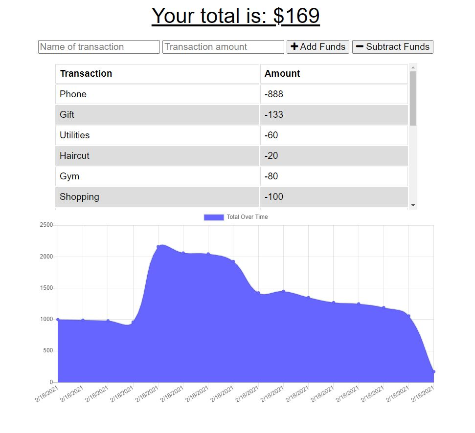

# Budget Tracker


## Table of Content

  - [Description](#description)

  - [Installation](#installation)

  - [Usage](#usage)

  - [Licence](#licence)

  - [Contributing](#contributing)

  - [Questions](#questions)

 ### Description

 Budget Tracker is an application that allows a user to add expenses and deposits to their budget with or without a connection. When entering transactions offline, they should populate the total when brought back online.

 The app is built using Node, MongoDB, Mongoose, Express, and Morga and IndexDB.

 The live app can be accessed [here](https://enigmatic-gorge-07171.herokuapp.com/).

 <p align="center">
    
</p>
 

### Installation

The application can be installed by using the following command: 

```bash
git clone https://github.com/caymanh/budget-tracker.git
```

### Usage

The application can be invoked by using the following commands: 

```bash
npm install
node server.js
```

### Licence

This application is covered by the [MIT](https://choosealicense.com/licenses/mit/) licence.

### Contributing

Pull requests are welcome. For major changes, please open an issue first to discuss what you would like to change.

### Questions

Please contact me if you have any questions regarding the application:

[Github](https://github.com/caymanh)

[Email](mailto:hengcayman@gmail.com)
